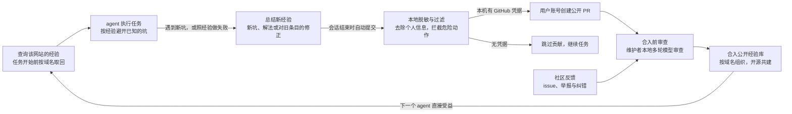

# Sitelore · Agent 网站经验共享库 · 产品需求文档（PRD）

Sep 28, 2026 · @tigerkid

> 本文件导出自 Claude Docs 上的同名文档（[原文](https://claude.ai/artifact/S4Bh8pkiD75AdRsSMPdJ5H)），导出时间 2026-09-28。文中涉及的技术选型和具体设计只是讨论中的想法，并未敲定。

> 2026-10-05 本地修订：已确认只维护代码仓库和数据仓库。MCP 在用户本地运行，使用用户现有的 GitHub 凭据直接提 PR；没有凭据就跳过贡献。模型审查由维护者本地运行，仓库检查和静态发布使用 GitHub Actions。不建设中心化代提交、查询或审查服务。该决定已同步到本文和技术设计；在线原文未同步。

## 概述

项目名为 Sitelore（site 加 lore，意为关于每个网站、由前人积累下来的经验），是一个中立的开源工具。任何 AI agent 用浏览器操作某个网站之前，先取回这个网站已有的操作经验；任务结束后，再把新踩到的坑总结成经验提交回去。经验库全球共建、公开维护，目标是让每个网站的坑只需要被踩一次。

本文是进入技术设计之前的需求文档，写清楚要解决什么问题、做什么、不做什么，以及讨论中已经定下的决定。条目格式、接口定义、审查提示词等具体设计，留给后续的设计文档。

## 背景与问题

agent 第一次调通某个网站时，往往要反复试错很久；这些坑别的 agent 多半早就踩过，但经验没有留下来。

常见的坑：

- 控件有特殊用法：日期框必须手动输入，下拉框要先点开再选，某个按钮滚动到可见后才能点。
- 时序问题：提交后要等某个元素出现，页面才算真正加载完。
- 流程里的隐性步骤：先关弹窗、先处理 cookie 提示，或者某个操作需要先在另一个页面打开设置。
- 环境差异：登录状态、地区、语言不同，页面结构和流程也不同。

每一次试错都是一轮模型调用，既耗时间又耗 token，也拉低了任务成功率。

复用经验的效果已有证据：

- 研究中复用已学到的流程，让 WebArena 成绩相对提升 51.1%（[Agent Workflow Memory](https://arxiv.org/abs/2409.07429)）。
- Skyvern 缓存流程后，一个任务从 279 秒降到 120 秒，成本从 $0.11 降到 $0.04（[Skyvern](https://www.skyvern.com/blog/asking-ai-to-build-scrapers-should-be-easy-right/)）。
- browsing-skills 的示例中，同一个 Booking.com 任务从约 49,290 token、82.5 秒降到约 3,903 token、9.5 秒（[browsing-skills](https://github.com/browsing-skills/browsing-skills)）。

但这些经验目前要么锁在各家的私有缓存里，要么绑定在某一个框架上，还没有一个跨工具、公开共建的地方。

## 目标用户与使用场景

主要用户是让 agent 替自己操作网站的开发者，第一批来自编码 agent 和浏览器自动化社区。

| 用户 | 典型场景 | 得到什么 |
| --- | --- | --- |
| 用编码 agent 驱动浏览器的开发者 | 让 agent 去云控制台、SaaS 后台完成配置 | 少走弯路，任务更快更稳 |
| 做浏览器自动化或 agent 产品的开发者 | 在自己的 agent 里接入经验查询 | 不必自己维护每个网站的适配 |
| 使用支持 MCP 的通用 agent 的个人用户 | 让 agent 订票、填表、查资料 | 更少失败，更少等待 |
| 贡献者与志愿审查者 | 维护自己熟悉的网站的经验 | 参与和影响一个公共项目 |

一个典型场景：agent 被派去某网站完成任务，先查到这个网站的已知经验，避开了两个已知的坑；中途遇到一个新坑，试错后解决；任务结束时，它把这个新坑和解法总结提交。下一个来这个网站的 agent，直接就知道了。

## 目标与非目标

核心目标是让网站经验跨 agent、跨工具流动起来，同时保持中立、开源、低门槛。

目标：

1. 任何 agent、任何浏览器工具，都能在操作网站前拿到该网站的已知经验。
2. 经验的积累是使用的副产品：agent 自动总结、自动提交，用户几乎不用额外付出。
3. 建立公开、开源、社区共建的经验库，并随使用持续更新。
4. 拦住会造成严重损失的恶意条目。

非目标：

- 不做浏览器，也不做浏览器引擎。个人开源项目在引擎深度上赢不了大公司，而且浏览器本身已经是大宗商品。
- 不绑定任何一个 agent 框架或浏览器工具。
- 不收录绕过反爬、验证码、风控的经验。
- 不存储网页内容、截图或用户数据，只存操作经验。
- 不先做某个垂直领域；覆盖靠社区共建扩展。
- 第一版不追求完备的防投毒体系，安全随规模逐步加强。
- 不建设中心化托管服务；公开协作依靠代码仓库和数据仓库，MCP 和模型审查在本地运行。

## 产品形态与核心流程

产品是一个中立的经验层，以 MCP server（可附带 skill 和提示词）的形式接入任何 agent。真正操作网页的，仍是用户已有的浏览器工具，比如 Playwright MCP、Chrome DevTools MCP、Browser Use、Claude in Chrome。

MCP 在用户本地运行，查询从 GitHub 读取公开静态数据；贡献使用本机现有的 GitHub 凭据，以用户自己的身份提交 PR。没有凭据时跳过贡献，继续用户任务，不要求登录。查询不需要 GitHub 身份。

核心循环：经验在使用中产生，再回到下一次使用。

经验在使用中产生，经过本地过滤和审查进入公开库，再在下一次访问同一网站时回到 agent 手里。照着经验做却失败，本身就会触发一次修正提交。

几个核心概念：

- **经验条目**：针对某个域名的一条可复用知识，比如某个控件怎么操作、要等什么、哪一步有隐性前提。它是描述性的数据，不是可执行代码。
- **适用条件**：同一域名在不同登录状态、地区、语言、页面版本下经验不同。每条经验要说明它在什么条件下成立，以及最后一次被确认有效的时间。
- **提交**：新增或修正经验，只能由工具生成并提交，不接受用户手写后直接合入。
- **修正**：照经验做发现不对时，对该条目的更正或失效标记。

## MVP 功能需求

第一版只需要跑通「查询—提交—审查—合入」这一个闭环，并能和主流 agent 工具配合使用。

| 编号 | 需求 | 说明 |
| --- | --- | --- |
| F1 | 按域名查询经验 | agent 操作某网站前，取回该域名下、符合当前适用条件的已有经验，以简短可读的形式进入上下文 |
| F2 | 提交新经验 | agent 总结新坑和解法，本地 MCP 脱敏、过滤后用用户自己的 GitHub 身份提 PR；无凭据则跳过 |
| F3 | 提交修正 | 照经验操作失败时，agent 提交对该条目的更正或失效标记 |
| F4 | 总结指引 | 工具随附给 agent 的规范：写什么、不写什么（不写个人信息、网页内容、绕过反爬的方法） |
| F5 | 本地脱敏与过滤 | 上传前在用户本地用规则去除邮箱、手机号、token、订单号等，并拦截涉及危险动作的条目 |
| F6 | 公开经验仓库 | 按域名组织，所有人可读，可以提 issue |
| F7 | 合入前审查 | 每次提交合入前经过模型多轮审查，必要时人工审查 |
| F8 | 读取时再过滤 | 客户端把经验交给 agent 之前，再做一遍危险动作过滤，作为最后一道防线 |
| F9 | 贡献开关 | 自动提交默认开启，用户可以一键关闭 |
| F10 | 工具中立 | 能与主流 agent 和浏览器工具配合，不依赖特定框架 |
| F11 | 下架响应 | 收到网站方投诉时，能按域名快速删除对应条目 |

第一版之后再考虑：志愿者分工审查的协作方式、过期经验的降权与清理、本地及仓库内的去重检查。

## 贡献与社区机制

贡献是使用的副产品：自动提交默认开启，用户不需要额外动手。

贡献以用户自己的 GitHub 身份创建公开 PR，首次使用时明确告知。没有本地凭据的用户只查询、不贡献；不会影响任务完成。用户可以用贡献开关关闭或恢复提交。

- **客户端开源。** 工具会上传数据，开源是用户愿意安装它的信任前提。闭源加强制上传的路线已经否决。
- **接受只用不贡献。** 维基百科和 OpenStreetMap 都是少数人贡献、多数人使用；程序员社区也有分享的传统。关键是把贡献成本压到接近零。
- **提交只能由工具生成。** 不接受用户直接编辑条目后合入；用户和社区通过 issue 反馈问题。
- **审查人力随规模扩展。** 早期由维护者负责；做大后组织志愿者分工审查，并可以接受捐赠来覆盖审查用的模型成本。
- **代码和经验数据均采用 MIT（2026-10-06 确认）。** 允许商业使用、修改和再分发，不限制商业训练；复制或分发时按许可证保留版权及许可声明。贡献者保留自己的权利，贡献采用 MIT。

## 质量与安全

安全策略是分级处理：会造成严重损失的投毒必须拦在合入之前，其余不准确的经验依靠使用中的失败反馈和社区纠正。

风险在于：经验会被注入到每一个访问该网站的 agent 里，agent 对它的信任高于对网页本身。一条恶意条目，等于一次通过可信渠道发出的提示注入。

1. **用规则拦截严重危险动作。** 包括：让 agent 把数据发往或跳转到其他域名；输入密码、验证码或支付信息；修改账号的邮箱、密码、2FA 或找回方式；同意 OAuth 授权或开启权限；下载或运行文件；忽略确认提示；额外购买或订阅。合入前拦一次，客户端读取时再拦一次。
2. **合入前多轮审查。** 每次提交由较强的模型多轮审查，不是单个模型审一次就合入。可疑写法应被标出，比如只说「勾选第几个选项」而不说明选项是什么。
3. **社区纠错。** 照经验做失败会自动触发修正提交；社区通过 issue 报告问题条目。
4. **边增长边完善。** 早期提交量小，被攻击的动机也小，先求好用和增长；规模扩大后，再根据实际遇到的攻击补充机制。

已考虑但不采用：用「多个独立来源都报告过」来验证条目。无法判断来源是否真的独立，攻击者开几个账号就能绕过。

## 隐私与法律

法律风险总体可控，策略是只存操作方法、不碰网页内容和个人信息，并对投诉快速响应。以下不构成法律意见，具体问题需要咨询律师。

- **只存怎么操作。** 不存网页内容、截图或 DOM。操作方法和事实一般不受著作权保护。
- **不收绕过反爬的经验。** 住宅代理、过验证码、规避风控之类的内容最容易招来律师函和平台下架，也和 agent 身份标准化的方向相反。平台态度正在收紧，例如 Amazon 在 2026 年 9 月以违反使用条件为由封禁了 Meta 的购物 agent（[Forkast](https://forkast.news/amazon-blocks-metas-muse-agent-from-shopping-and-signals-a-new-tollgate-for-agent-commerce/)）。
- **个人信息在上传前清除。** 登录状态下总结的经验，容易带出用户名、订单号、内部 URL、token。脱敏要在本地用规则完成，不能只靠提示词让 agent 自觉；审查时再检查一次。
- **公开仓库删不干净。** 删除的内容仍留在 git 历史和他人的 fork 里，所以个人信息必须在合入前清除，事后删除补救不了。
- **通知—删除。** 收到网站方的律师函或投诉，删除对应网站的条目。
- **国内运营的合规。** 如果由国内主体运营，自动收集用户使用中产生的数据，需要满足个人信息保护法对告知同意和最小化的要求。

## 竞品与差异化

共享站点经验这个机制已经有人在做；本项目的差异在于不绑定任何工具、经验是数据而不是代码、合入前有审查。

| 项目 | 做法 | 与本项目的差别 |
| --- | --- | --- |
| [Browser Harness](https://github.com/browser-use/browser-harness)（Browser Use） | agent 自动写站点技能（Python 文件），用户通过 PR 合入中央仓库 | 绑定自家 harness；技能是可执行代码；文档里未见审查或防投毒机制 |
| [browsing-skills](https://github.com/browsing-skills/browsing-skills) | 人工编写的 JS 技能，覆盖 23 个网站，MIT 协议，约 110 star | 靠人工编写，扩展慢；是代码而不是经验 |
| [Tabbit](https://www.tabbit.ai/) | 闭源 AI 浏览器，称为最常用的 100 个网站预置了 2,000 个技能 | 闭源，绑定自家浏览器 |
| Stagehand、Skyvern、Anchor 等 | 把成功流程缓存成可回放的脚本 | 私有，不在用户之间共享 |

以上信息截至 2026 年 9 月 28 日。

## 冷启动与推广

路线是先把生态做起来、靠共建扩展覆盖面，而不是先把某个垂直领域做满。

- **为什么不先做垂直领域：** 同一个域名在不同登录状态和环境下经验不同，而且会不断变化，只有大量用户在真实使用中持续提交才维护得住。
- **种子经验：** 维护者先做一批，作为吸引早期用户的卖点。优先挑 agent 最常被派去、最容易出错的网站，提高新用户第一次使用时「查得到」的概率。
- **推广对象：** 编码 agent 和浏览器自动化的开发者社区。接入成本要低到「加一个 MCP server 就能用」。

## 成本与可持续性

用户侧的额外成本很小，主要成本在维护方的审查。

| 成本项 | 谁承担 | 说明 |
| --- | --- | --- |
| 查询经验 | 用户 | 注入少量文本，通常还能省下试错消耗的 token |
| 总结与提交 | 用户的 agent | 会话结束时操作过程已在上下文里，只多几百到一两千输出 token |
| 合入前审查 | 维护方 | 模型多轮审查的 token，加上人工时间 |
| 仓库托管 | 维护方 | 公开仓库本身成本很低 |

提交由 agent 自动生成，数量随使用量增长，而不是随人力增长，所以审查负载可能比一般开源项目增长得快。应对方式是志愿者在各自本地分工审查和接受捐赠。项目只维护两个仓库，不承担自建后端的运行成本；参与者的模型用量和人工时间仍然存在。

## 已接受的风险

下面这些风险已经识别，决定暂不为它们投入设计；真遇到了再应对。

- **没有技术壁垒。** 项目的价值来自社区和数据积累，而不是技术深度。
- **模型进步可能降低需求。** 如果模型第一次就能用好任何网站，经验库的价值会下降。
- **大公司入场。** 比如 Browser Use 把类似机制做成中立平台，或者模型厂商用自家的使用数据把这件事内化。
- **早期安全机制不完备。** 第一版只保证拦住严重投毒，其余随规模补强。

## 决策记录

讨论中已经定下的事项如下，后续设计以此为前提。

| 议题 | 结论 | 理由 |
| --- | --- | --- |
| 做浏览器还是做工具 | 做中立工具，不做浏览器 | 个人开源项目在引擎深度上无法和大公司竞争；工具层可以接入任何浏览器 |
| 许可证（2026-10-06） | 代码和经验数据均采用 MIT | 保持轻量，允许商业使用，不设训练用途限制 |
| 开源还是闭源 | 开源 | 工具会上传数据，开源是信任前提；闭源加强制上传很难让开发者安装 |
| 只用不贡献 | 接受，不设限制 | 贡献自动完成、成本接近零；程序员社区有分享的传统 |
| 谁能提交 | 只由工具生成提交，审查后合入 | 减少随意提交带来的攻击面 |
| 提交身份（2026-10-05） | 本地 MCP 只用用户自己的 GitHub 凭据提 PR；无凭据就跳过 | 接受只读使用，复用用户已有能力 |
| 运行边界（2026-10-05） | 代码仓库 + 数据仓库；MCP 和模型审查在本地，仓库检查与静态发布在 GitHub Actions | 保持轻量，不建设中心化托管服务，也不作为后续方向保留 |
| 经验的形式 | 描述性的经验，不是可执行代码 | 跨工具通用，也降低风险 |
| 多来源共识验证 | 不采用 | 无法判断来源是否独立，开小号就能绕过 |
| 防投毒的底线 | 只保证拦住会造成严重损失的投毒 | 其余不准确的内容靠失败反馈和社区纠错 |
| 安全机制的节奏 | 边增长边完善 | 早期提交少，被攻击的动机也小 |
| 是否先做垂直领域 | 不做，先做生态 | 经验随环境变化、需要持续更新，只能靠共建 |
| 法律风险 | 规范总结内容 + 审查 + 收到投诉即删除 | 风险相对可控 |
| 用户的 token 成本 | 可接受 | 总结只多少量输出 token |
| 外部风险 | 暂不考虑 | 几乎任何项目都面临同样的风险 |
| 项目名称 | Sitelore | site 加 lore，意为网站的前人经验；2026-09-28 查询时，npm 包名和 GitHub 组织名都未被占用 |

## 开放问题

进入设计阶段之前，需要定下这些事：

- [ ] 经验条目的格式：有哪些字段，适用条件怎么表达，最后验证时间怎么记录。
- [ ] 给 agent 的总结指引：写什么、不写什么，什么样的经验值得提交。
- [ ] 严重危险动作的完整清单，以及怎么判定。
- [ ] 审查流程：用哪些模型、审几轮、什么时候需要人工。
- [x] 数据授权协议：MIT，和代码一致（2026-10-06 确认）。
- [ ] 过期经验如何降权或清理。
- [ ] 首批种子网站清单。
- [ ] 域名：sitelore.dev 或 sitelore.com 是否可以注册。

## 来源

- [Agent Workflow Memory（arXiv）](https://arxiv.org/abs/2409.07429)
- [Skyvern 博客：缓存流程后的速度与成本](https://www.skyvern.com/blog/asking-ai-to-build-scrapers-should-be-easy-right/)
- [browsing-skills（GitHub）](https://github.com/browsing-skills/browsing-skills)
- [Browser Harness（GitHub）](https://github.com/browser-use/browser-harness)
- [Tabbit 官网](https://www.tabbit.ai/)
- [Forkast：Amazon 封禁 Meta 的购物 agent](https://forkast.news/amazon-blocks-metas-muse-agent-from-shopping-and-signals-a-new-tollgate-for-agent-commerce/)
